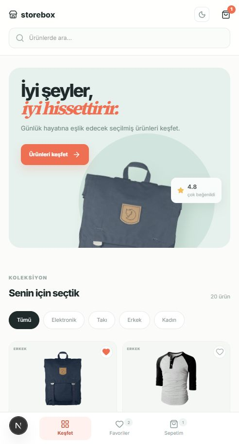
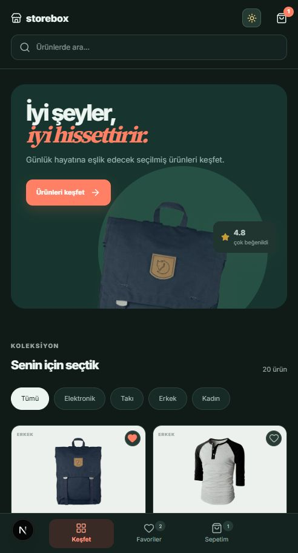
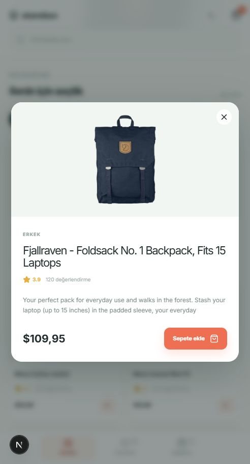
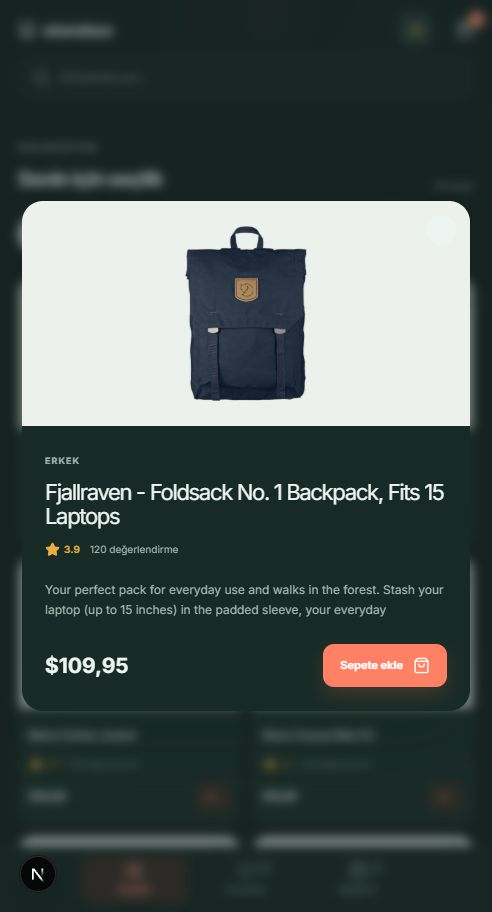
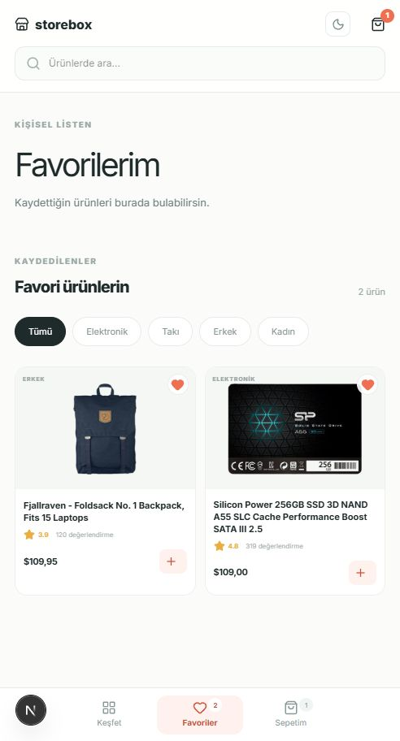
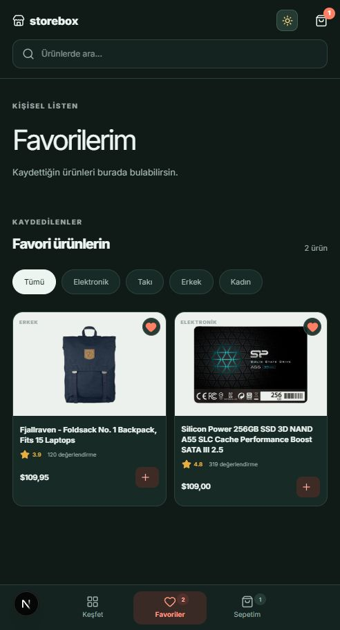
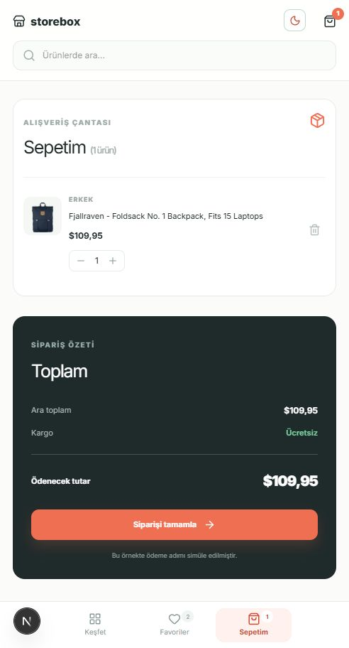
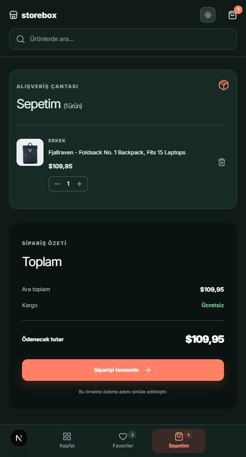

# StoreBox — React Native Bitirme Projesi

Bu dosya, React Native eğitimi kapsamında geliştirilecek StoreBox uygulamasının bitirme projesi yönergesidir.

StoreBox; Fake Store API'den ürünleri alan, ürünleri arama ve kategoriye göre filtreleme imkânı sunan, ürün detaylarını gösteren ve favori/sepet yönetimi sağlayan bir mobil alışveriş uygulamasıdır. Proje; React Native, Expo, navigation, component, props, state, hook, API isteği, Context API ve AsyncStorage konularını birlikte uygulamayı amaçlar.

Gerçek ödeme, gerçek kullanıcı hesabı veya ayrı bir backend beklenmez. Uygulama eğitim amaçlı bir demo olarak hazırlanacaktır.

## 1. Proje hedefi

Kullanıcı uygulamayı açtığında ürünleri inceleyebilmeli, istediği ürünü bulabilmeli, ürün detayını görebilmeli, favori listesi oluşturabilmeli ve sepetini yönetebilmelidir.

Uygulama yapısı [MovieBox örnek projesinden](https://github.com/eminbasbayan/movie-box) ilham alabilir. Ancak arayüz ve kod birebir kopyalanmamalı; öğrencinin kendi tasarımını ve proje organizasyonunu oluşturması beklenmelidir.

## 2. Teknoloji ve API

### Kullanılacak teknoloji

- React Native
- Expo
- Expo Router veya derste kullanılan navigation yapısı
- JavaScript
- Context API
- AsyncStorage
- fetch veya Axios
- Fake Store API
- Git ve GitHub

Expo ile proje oluşturma ve çalıştırma için [Expo — Create a project](https://docs.expo.dev/get-started/create-a-project/) ve React Native temelleri için [React Native — Getting Started](https://reactnative.dev/docs/getting-started) dokümanları kullanılabilir.

### Fake Store API

Temel adres:

~~~text
https://fakestoreapi.com
~~~

Kullanılabilecek endpointler:

~~~text
GET /products
GET /products/:id
GET /products/categories
GET /products/category/:category
~~~

Örnek istek:

~~~js
const response = await fetch("https://fakestoreapi.com/products");

if (!response.ok) {
  throw new Error("Ürünler alınamadı.");
}

const products = await response.json();
~~~

Fake Store API eğitim ve prototip amaçlı bir REST API'dir. Favori ve sepet verileri API'de kalıcı olarak saklanmadığı için bu veriler uygulama içinde yönetilmeli ve AsyncStorage ile cihazda tutulmalıdır. [Fake Store API resmî GitHub deposu](https://github.com/keikaavousi/fake-store-api)

## 3. Zorunlu uygulama kapsamı

Bu bölüm, uygulamada bulunması gereken ekranları ve kullanıcı işlemlerini tanımlar.

### Ana sayfa

- Ürünler API'den alınarak kart veya grid görünümünde listelenmelidir.
- Arama alanı ve kategori seçimi bulunmalıdır.
- Ürün kartında en az görsel, ad, fiyat ve kategori bilgisi yer almalıdır.
- Kart üzerinden ürün detayına, favoriye ekleme işlemine ve sepete ekleme işlemine ulaşılabilmelidir.
- Açık/koyu tema değiştirme kontrolü bulunmalıdır.

### Ürün detay ekranı

- Ürün görseli, adı, fiyatı, kategorisi ve açıklaması gösterilmelidir.
- Varsa ürün puanı ve değerlendirme sayısı gösterilmelidir.
- Ürün favoriye eklenebilmeli veya favoriden çıkarılabilmeli; sepete eklenebilmelidir.

### Favoriler ekranı

- Favoriye alınan ürünler listelenmeli, istenen ürün favorilerden çıkarılabilmelidir.
- Ürün detayına geçiş yapılabilmelidir.
- Liste boş olduğunda açıklayıcı bir durum mesajı gösterilmelidir.

### Sepet ekranı

- Sepetteki ürünler, adetleri ve ürün bazlı tutarları gösterilmelidir.
- Adet artırma, azaltma ve ürünü silme işlemleri yapılabilmelidir.
- Ara toplam ve genel toplam güncel tutulmalıdır.
- Siparişi tamamla butonu bulunmalıdır.

### Sipariş tamamlandı ekranı

Gerçek ödeme alınmayacaktır. Siparişi tamamla işleminden sonra basit bir başarı mesajı gösterilmesi yeterlidir:

~~~text
Siparişiniz başarıyla oluşturuldu.
Bu proje eğitim amaçlı bir demo uygulamasıdır.
~~~

### Uygulamanın ortak davranışları

- Veri yüklenirken loading durumu gösterilmelidir.
- API isteği başarısız olduğunda hata mesajı gösterilmelidir.
- Arama veya kategori sonucu bulunamadığında boş sonuç durumu gösterilmelidir.
- Favoriler, sepet ve tema tercihi uygulama yeniden açıldığında korunmalıdır.
- Tema değişimi tüm ekranlarda tutarlı görünmelidir.
- Ekranlar küçük cihazlarda taşma yapmamalıdır.
- Uygulama en az bir Android cihazda veya emülatörde test edilmelidir.

## 4. Teknik uygulama kuralları

Bu bölüm, özelliklerden ayrı olarak kodun nasıl düzenleneceğini açıklar.

- API adresi tek bir sabit veya yardımcı dosyada tutulmalıdır.
- Her API isteğinden sonra response.ok kontrol edilmelidir.
- Ürün kartı, arama alanı, kategori seçimi ve sepet elemanı gibi tekrar kullanılabilecek parçalar component olarak yazılmalıdır.
- Favori, sepet ve tema gibi ortak veriler Context API veya anlaşılır bir üst seviye state yapısıyla yönetilmelidir.
- Sepet ürünlerinde quantity alanı bulunmalı; toplam tutar ürün fiyatı ve adet üzerinden hesaplanmalıdır.
- AsyncStorage okuma ve yazma işlemlerinde oluşabilecek hatalar ele alınmalıdır.
- Ürün görseli yüklenemese bile uygulamanın geri kalan bölümleri çalışmalıdır.
- Şifre, API anahtarı veya kişisel bilgi repository'ye gönderilmemelidir.

## 5. Önerilen klasör yapısı

Klasör isimleri değişebilir. Amaç, ekranları ve tekrar kullanılabilir parçaları anlaşılır biçimde ayırmaktır:

~~~text
storebox/
├── app/
│   ├── (tabs)/
│   │   ├── index.js          # Ana sayfa
│   │   ├── search.js         # Arama ve kategori sonuçları
│   │   ├── favorites.js      # Favoriler
│   │   └── cart.js           # Sepet
│   └── product/
│       └── [id].js           # Ürün detay
├── components/
│   ├── ProductCard.js
│   ├── SearchBar.js
│   ├── CategoryChip.js
│   ├── CartItem.js
│   ├── LoadingSpinner.js
│   └── ErrorState.js
├── context/
│   ├── FavoritesContext.js
│   ├── CartContext.js
│   └── ThemeContext.js
├── hooks/
│   ├── useProducts.js
│   └── useDebounce.js
├── constants/
│   └── api.js
├── assets/
├── app.json
├── package.json
└── README.md
~~~

Bu yapı zorunlu bir şablon değildir. Ekranların tek dosyada karmaşık hâle gelmemesi ve ortak işlemlerin tekrar kullanılabilir yapılarla yönetilmesi yeterlidir.

## 6. Başarılı teslim için minimum beklenti

Öğrenci GitHub repository'sinde aşağıdaki teslim içeriğini paylaşmalıdır:

- Çalışan React Native/Expo projesi
- package.json dosyası
- Projeyi kurma ve çalıştırma adımları
- Öğrenci tarafından yazılmış README.md dosyası
- Kullanılan API ve endpoint bilgileri
- Android cihaz veya emülatör test bilgisi
- Uygulamaya ait ekran görüntüleri veya kısa demo videosu
- Bilinen eksikler ve sınırlamalar

Başarılı teslim için bu yönergede belirtilen zorunlu ekran ve davranışların çalışması, uygulamanın yeniden açıldığında gerekli yerel verileri koruması ve projenin README takip edilerek kurulabilmesi gerekir.

node_modules, şifre, API anahtarı veya kişisel bilgiler repository'ye yüklenmemelidir.

Gerçek ödeme, kullanıcı hesabı, yönetici paneli, backend, veritabanı, stok/kargo takibi ve bildirim sistemi bu projenin zorunlu kapsamı dışındadır.

## 7. Öğrencinin kendi README.md dosyası

GitHub README'si, projeyi inceleyen kişinin uygulamanın ne yaptığını ve nasıl çalıştırılacağını anlayabilmesini sağlamalıdır. GitHub, README içinde projenin amacı, kullanım şekli, kurulum adımları ve katkı sağlayan kişiler gibi bilgilerin bulunmasını önerir. [GitHub — About README files](https://docs.github.com/en/repositories/managing-your-repositorys-settings-and-features/customizing-your-repository/about-readmes)

README içinde en az şu başlıklar bulunmalıdır:

~~~markdown
# StoreBox

## Proje hakkında

## Özellikler

## Kullanılan teknolojiler

## Kurulum

## Uygulamayı çalıştırma

## API bilgisi

## Klasör yapısı

## Ekran görüntüleri veya demo videosu

## Bilinen sınırlamalar

## Geliştirici
~~~

Kurulum ve çalıştırma bölümü için örnek:

~~~bash
npm install
npx expo start
~~~

Kullanılan Expo sürümüne göre komut değişiyorsa README içinde projeye uygun komut belirtilmelidir.

## 8. Proje ekran görüntüleri

Aşağıdaki görseller StoreBox örnek uygulamasının mobil ekranlarından alınmıştır. Tasarım ve beklenen ekran çeşitliliği için referans olarak kullanılabilir. Öğrenci, kendi uygulamasından aldığı görselleri teslim README'sine eklemelidir.

### Ana sayfa

### Ürün detay ekranı

### Favoriler ekranı

### Sepet ekranı

Görseller öğrencinin repository'sinde örneğin şu klasörde tutulabilir:

~~~text
assets/screenshots/
├── home.png
├── product-detail.png
├── favorites.png
├── cart.png
├── home-dark.png
├── product-detail-dark.png
├── favorites-dark.png
└── cart-dark.png
~~~

README içinde görsel kullanımı:

~~~markdown

~~~

## 9. İsteğe bağlı geliştirmeler

Zorunlu kapsam tamamlandıktan sonra aşağıdaki özelliklerden biri veya birkaçı eklenebilir:

- Fiyata veya puana göre sıralama
- Son görüntülenen ürünler
- Yerel sipariş geçmişi
- Offline son ürün listesini gösterme
- Ürün detayında benzer ürünler
- Sahte adres formu
- Onboarding ekranı

## 10. Önerilen çalışma sırası

1. Expo projesini ve temel navigation yapısını oluştur.
2. Fake Store API bağlantısını kurup ürün verisini listele.
3. Ana sayfa, arama, kategori ve ürün detay ekranlarını tamamla.
4. Favori ve sepet state yönetimini kur; kalıcılığı AsyncStorage ile ekle.
5. Açık/koyu temayı, loading-hata-boş durumlarını ve küçük ekran uyumunu tamamla.
6. Android testini yap, ekran görüntülerini al ve README'yi doldur.
