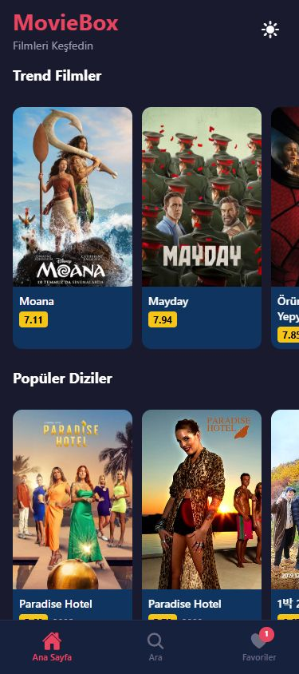
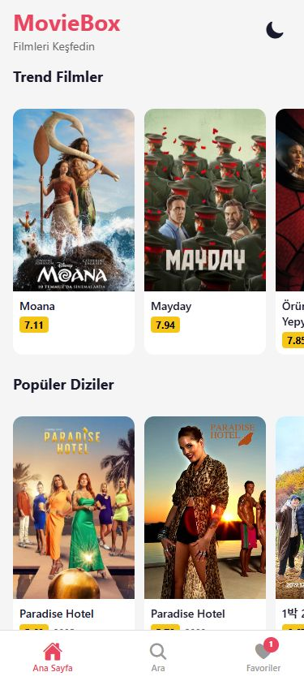
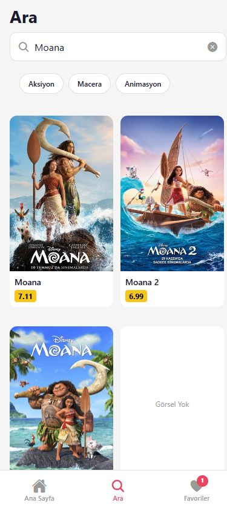
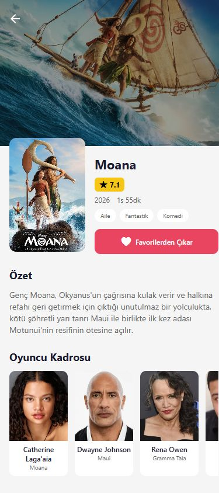
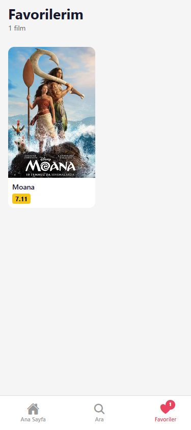

# MovieBox

MovieBox, React Native ve Expo kullanılarak geliştirilen bir film keşif uygulamasıdır. Uygulama; film ve dizileri farklı kategorilerde listeler, TMDB API üzerinden arama yapar, film detaylarını gösterir ve kullanıcıların favori listesi oluşturmasına izin verir.

## Eğitim bağlamı

Bu proje, BilGen Yazılım Akademi tarafından hazırlanan **Uygulamalı React Native Eğitimi - Film Uygulaması** kursu kapsamında geliştirilen uygulamanın çalışma kodlarını içerir.

Eğitim sayfası: [Uygulamalı React Native Eğitimi - Film Uygulaması](https://bilgenakademi.com/course/uygulamali-react-native-egitimi)

## Proje özellikleri

- Trend filmler, popüler diziler, en yüksek puanlı yapımlar ve yakında vizyona girecek içerikler
- TMDB API üzerinden film arama
- Türlere göre film keşfetme
- Film ve dizi detay ekranı
- Arka plan görseli, poster, özet, puan, tür ve yayın bilgileri
- Oyuncu kadrosu ve benzer filmler
- Favorilere ekleme ve favorilerden çıkarma
- Açık/koyu tema değiştirme
- Loading ve hata durumları
- Arama alanında debounce kullanımı
- Favorilerin cihazda saklanması

## Projede kullanılan konular

Proje, aşağıdaki React Native konularını pratikte bir araya getirir:

- Expo projesi kurulumu ve gereksiz dosyaların düzenlenmesi
- Constants dosyalarıyla renk ve yazı stillerinin merkezileştirilmesi
- Expo Router ile Stack, Tabs ve dinamik route kullanımı
- SafeAreaView, StyleSheet, FlatList ve yatay listeler
- Tekrar kullanılabilir MovieCard, MovieSection, SearchBar, GenreChip ve ActorCard bileşenleri
- useState, useEffect, useWindowDimensions ve özel hook oluşturma
- Theme Context, useColorScheme ve AsyncStorage ile tema kalıcılığı
- TMDB API, environment variable, fetch ve useMovies hook'u
- Loading, error ve boş içerik durumlarının yönetimi
- Favorites Context ve useFavorites hook'u
- useDebounce ile kontrollü film araması

## Kullanılan teknolojiler

- React Native
- Expo
- Expo Router
- JavaScript
- React Context API
- AsyncStorage
- TMDB API
- Expo Vector Icons

## Kurulum

### 1. Projeyi indir

~~~bash
git clone https://github.com/eminbasbayan/movie-box.git
cd movie-box
~~~

### 2. Paketleri yükle

~~~bash
npm install
~~~

### 3. TMDB API anahtarını ekle

Proje kök dizininde .env.local adında bir dosya oluşturun:

~~~env
EXPO_PUBLIC_TMDB_API_KEY=TMDB_API_ANAHTARINIZ
~~~

API anahtarı repository'ye gönderilmemelidir. .env*.local dosyaları Git tarafından göz ardı edilir.

### 4. Uygulamayı çalıştır

~~~bash
npx expo start
~~~

Expo geliştirme ekranında aşağıdaki seçeneklerden biri kullanılabilir:

~~~bash
npm run web
npm run android
npm run ios
~~~

Android için Expo Go veya Android emülatörü kullanılabilir. iOS için macOS ve iOS simülatörü gereklidir.

## TMDB API kullanımı

API bağlantısı constants/api.js dosyasında tanımlanmıştır. Uygulama Türkçe içerik almak için language=tr-TR parametresini kullanır.

Kullanılan temel istekler:

~~~text
GET /trending/movie/week
GET /movie/top_rated
GET /movie/upcoming
GET /tv/popular
GET /search/movie
GET /discover/movie
GET /movie/:id
GET /movie/:id/credits
GET /movie/:id/similar
GET /tv/:id
GET /tv/:id/credits
GET /tv/:id/similar
~~~

Film detayında gerekli bilgiler, detay, oyuncu kadrosu ve benzer filmler için yapılan isteklerin birlikte tamamlanmasıyla hazırlanır.

## Proje yapısı

~~~text
movie-box/
├── app/
│   ├── _layout.js              # Root Stack ve provider bağlantıları
│   ├── (tabs)/
│   │   ├── _layout.js          # Alt sekme navigasyonu
│   │   ├── index.js            # Ana sayfa
│   │   ├── search.js           # Arama ve tür filtreleri
│   │   └── favorites.js        # Favoriler
│   └── movie/
│       └── [id].js             # Dinamik film detay ekranı
├── components/
│   ├── MovieCard.js
│   ├── ActorCard.js
│   ├── SearchBar.js
│   ├── GenreChip.js
│   ├── Counter.js
│   ├── LoadingSpinner.js
│   └── ErrorState.js
├── constants/
│   ├── api.js
│   ├── colors.js
│   └── fonts.js
├── context/
│   ├── ThemeContext.js
│   └── FavoritesContext.js
├── hooks/
│   ├── useMovies.js
│   └── useDebounce.js
├── assets/
├── app.json
├── package.json
└── README.md
~~~

## Ekran görüntüleri

Aşağıdaki görseller proje çalıştırılarak 375 × 844 mobil ekran ölçüsünde alınmıştır.

### Ana sayfa — koyu tema

### Ana sayfa — açık tema

### Arama ve tür filtreleri

### Film detay ekranı

### Favoriler

## Temel kullanıcı akışı

1. Kullanıcı ana sayfada film ve dizileri inceler.
2. Tema butonuyla açık veya koyu görünümü seçer.
3. Arama alanından bir film arar veya tür seçer.
4. Bir film kartına dokunarak detay ekranını açar.
5. Film detayındaki butonla yapımı favorilerine ekler.
6. Favoriler sekmesinden kayıtlı filmlerini görüntüler.

## Eğitim amaçlı proje notu

Bu çalışma, gerçek bir yayın platformu değildir. Proje; mobil arayüz geliştirme, API'den veri alma, ekranlar arası geçiş, ortak state yönetimi ve cihazda veri saklama konularını öğrenmek için hazırlanmıştır. Film bilgileri TMDB API'den geldiği için sonuçlar zaman içinde değişebilir.

## Bilinen sınırlamalar

- Uygulamanın çalışması için geçerli bir TMDB API anahtarı gerekir.
- Film ve dizi verileri internet bağlantısına bağlıdır.
- Kullanıcı hesabı, giriş sistemi ve gerçek ödeme akışı bulunmaz.
- Favoriler yalnızca kullanılan cihazın yerel depolamasında tutulur.
- Film izleme, fragman oynatma veya gerçek bilet satın alma özelliği yoktur.

## Geliştirici

Emin Başbayan

GitHub: [eminbasbayan](https://github.com/eminbasbayan)
